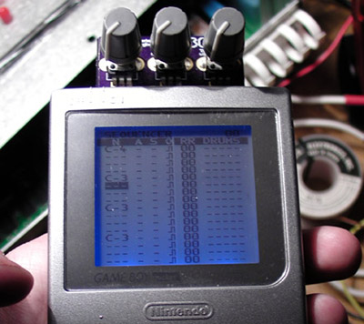
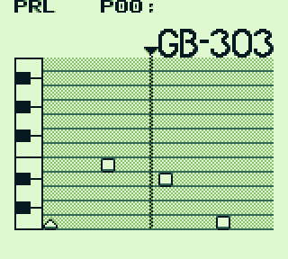
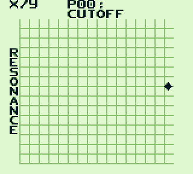
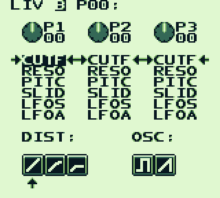

# GB303 
GB303 wavetable-based TB-303 style synthesizer for the Nintendo Gameboy.

License: (CC BY 4.0) furrtek 2014~2015. http://creativecommons.org

## Screencaps

## How to kill a project

* Have an idea
* Spend 5 months making it real
* Take pre-orders
* Order PCBs from an awful board house
* Assemble PCBs
* Realize that 90% of the PCBs have soldermask misaligned, which made them pass E-test but short out during reflow
* Can't buy new ones because low profit margin
* Feel like shit
* Ignore people
